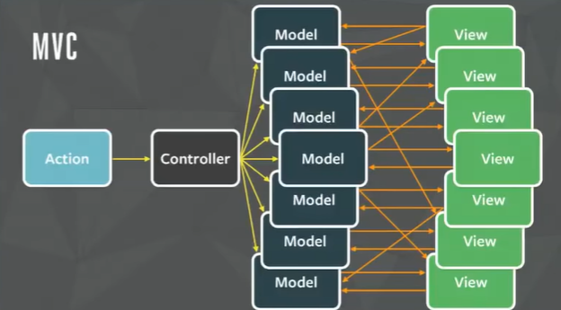

# 개발 환경 세팅


우리는 Node.js 를 기반으로 개발을 하는데 왜 이게 어렵냐면 계속 바뀌기 때문.&#x20;

정리하고 있는 지금도 버전이 달라지고 있음.

그러므로 앞으로 전체적인변흐름을경파악하고 변경 대응할 수 있는 능력을 키우는게 중요


\=> 이 능력은 어떻게 키우는가?&#x20;

<mark style="background-color:orange;">=> 강의를 들으며 찾아보고 못찾으면 구체적으로 질문.</mark>

\=> 내 생각으로개발할때 개발환경을 항상 생각하면서 개발하는 습관을 갖는것?


### JavaScript(Node.js) 개발 환경 세팅(global)

1.  Node.js

    [https://nodejs.org/](https://nodejs.org/)
2. Node.js Version manager

&#x20;    우리가 NVM으로 익숙한 것.

&#x20;    속도가 빠른 fnm을 사용.

&#x20;    \- fnm (Fast Node Manager)

&#x20;      [https://github.com/Schniz/fnm](https://github.com/Schniz/fnm)


내 환경은 wsl이

.fnm, .node 등의 글로벌 파일들은 시스템 자체인 /home 에 존재

더불어 React는hot reloader 가 mnt/\~ 에서는 작동이 안되기 때문에 /home 이후인 곳에 폴더를 위치시킨다.


### TypeScript + React + Jest + Parcel

> mkdir \<my-app>
>
> cd \<my-app>

1. npm

> npm init

옵션들이 많이 나오는데 한번 쭉 읽어보아라.

> npm i -y //추가적인 옵션 질문들에 걍 다 yes 하겠다.

package.json

```
{
  "name": "my-app",
  "version": "1.0.0",
  "description": "",
  "main": "index.js",
  "scripts": {
    "test": "echo \"Error: no test specified\" && exit 1"
  },
  "keywords": [],
  "author": "",
  "license": "ISC"
}
```

\=> script의 용도는

> npm run test&#x20;

하면 "echo \\"Error: no test specified\\" && exit 1" 이 쉘 스크립트가 실행된다. 딴거 쓰면 딴거 나옴.

실행 예약어들을 넣는다. 앞으로 cra를 쓰면 자동으로 생기는 dev, start 등등의 역할들.

2. .gitignore

```
/node_modules/ //폴더라는 의미가 담김
or
node_modules/ //현재 위치
or
node_modules //아몰랑 이 이름 다.
```

[https://www.toptal.com/developers/gitignore/](https://www.toptal.com/developers/gitignore/)


3. typescript

> npm i -D typescript

<mark style="background-color:orange;">npm의 버전에대한 이야기는 없네 => 강의 듣고 내용 없으면 질문</mark>



```
{
  "name": "my-app",
  "version": "1.0.0",
  "description": "",
  "main": "index.js",
  "scripts": {
    "test": "echo \"Error: no test specified\" && exit 1"
  },
  "keywords": [],
  "author": "",
  "license": "ISC",
  "devDependencies": {
    "typescript": "^4.9.5"
  },
  "dependencies": {
    "react": "^18.2.0"
  }
}
```

\=> devDependencies는 앞에 dev가 붙어서 알듯이 개발할때 사용하는 패키지이다.

\=> 배포할때는 devDependencies를 빼고 배포가 가능한데 배포하는 크기를 조금 줄여줄 수 있다.

<mark style="background-color:orange;">=> 이 줄이는 부분의 메리트 또는 아주 작은 메리트가 있더라도 구체적으로 어느 정도의 이득인지 내가 이건 해볼 수 있을것. 해보고도 모르겠으면 질문.</mark>

\=> 또 다른 메리트는 누군가 devDependencies에 악의적으로 무슨 짓을 할수도 있는데 그걸 방지하기 위함


아무튼 이 설치로 로컬 환경의 node\_modules에 typescript 패키지가 설치되고 함께 .bin에 관련 파일들도 생성이 된다. 예를 들면, 아래의 tsc 그래서 아래의 tsc는 npx를 통해 작업이 가능한 것.


> npx tsc --init

tsc는 ts 컴파일러다.

npx가 하는 일은 별도 패키지 설치 없이&#x20;

```
- node_modules
ㄴ.bin
   ㄴtsc
```

node\_modules에 있는 .bin 에 있는 tsc를 실행시킴.

실제로 npx 없이

> ./node\_modules/.bin/tsc&#x20;

로 실행시킬 수 있다.

npx를 사용하면 node\_modules에 패키지를 실제 설치하는게 아니라 어떤 캐시에 저장을 해 활용을 하게 됨

또한, 그래서 옛날에는 npm으로 글로벌로 tsc를 설치하곤 했는데 지금은 npx를 하면 해당 폴더 안의 node\_modules>.bin>tsc를 실행하기 때문에 굉장히 성능이 좋고 빠르다.

<mark style="background-color:orange;">=> 구체적으로 이 '캐시' 라는 거의 작동 원리나 해당 내용 지식을 알아보자</mark>
